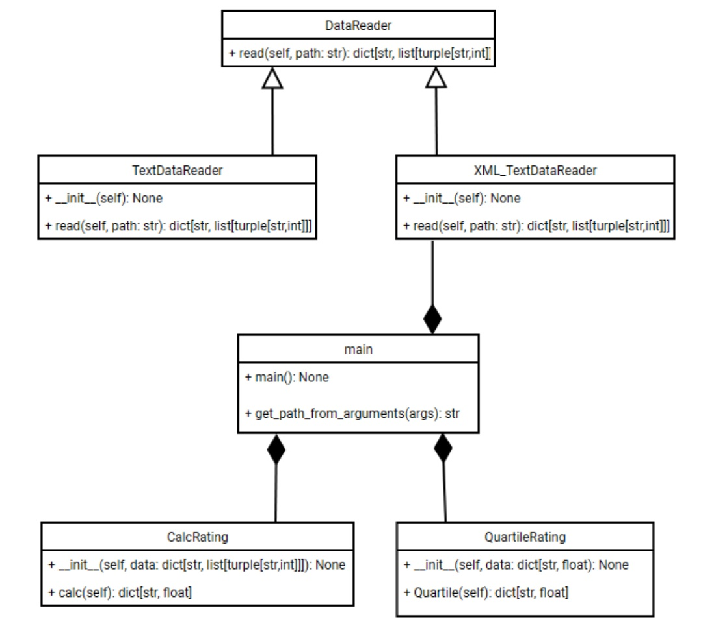

# Лабораторная 1 по дисциплине "Технологии программирования"
### Постановка задачи
Необходимо разработать программу, которая будет анализировать рейтинг студентов, вычислять первую квартиль и выводить список студентов, чей рейтинг попадает в этот диапазон. Входные данные представляют собой XML-файл с информацией о студентах.
### Краткое описание проекта
- **Тип лицензии:** Добавить файл с выбранной лицензией.
- **Файл .gitignore:** Создать файл .gitignore, исключив из репозитория временные файлы и зависимости.
- **Класс для обработки XML**: Реализовать класс, который будет читать данные из XML-файла, парсить информацию о студентах и их рейтингах.
- **Класс для расчета первой квартиль**: Реализовать класс, который будет вычислять первую квартиль по рейтингам студентов и выводить студентов, чьи рейтинги попадают в эту категорию.
- **Тестирование**: Написать модульные тесты для всех классов.
- **UML-диаграмма классов**: Составить UML-диаграмму, отображающую структуру классов проекта.
### Используемые языки / библиотеки / технологии,
Язык: python 3.12.4
Библиотеки: pytest, xml, abc, sys, 
Технологии: Git, GitHub Actions
### UML-диаграмма

### Выводы по работе
В ходе лабораторной работы были освоены основные функции системы контроля версий Git, включая работу с ветвями, коммитами и слияниями. Изучены принципы непрерывной интеграции (CI) и непрерывного развертывания (CD), а также настройка автоматизированных процессов с помощью GitHub Actions. Получены навыки разработки ООП-программ и написания модульных тестов. 
